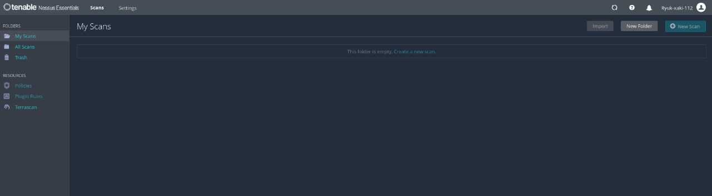
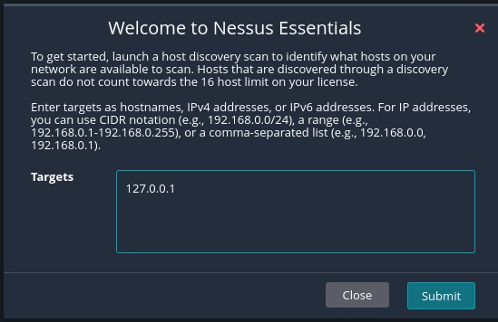
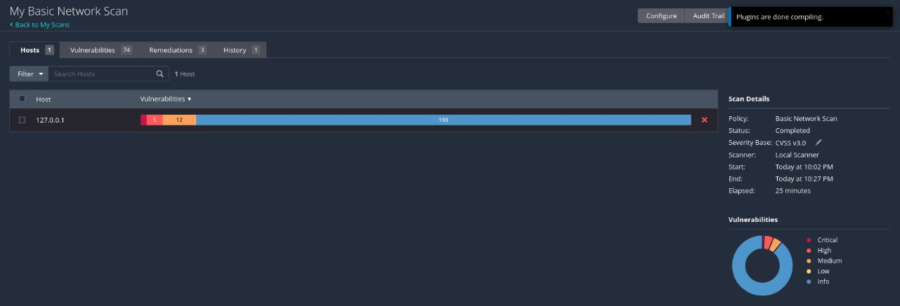
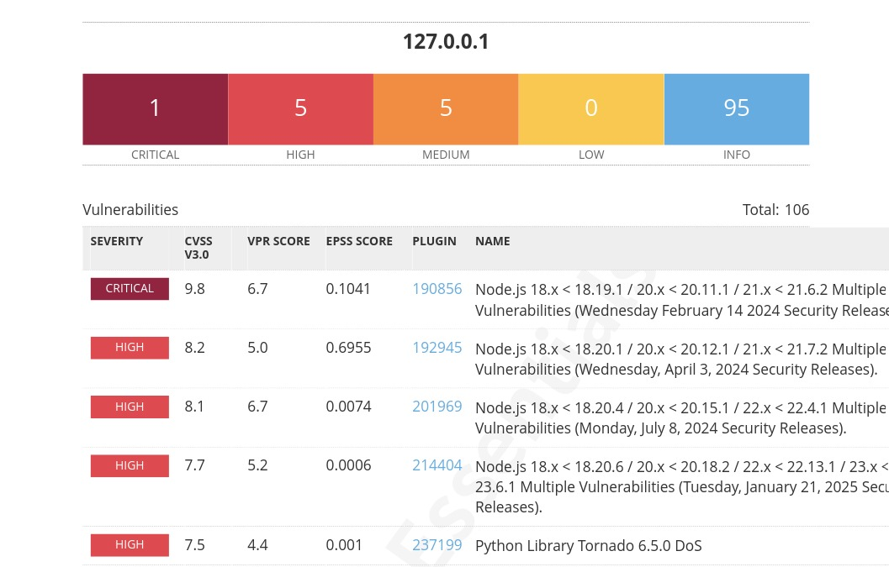

# 📄 Vulnerability Scan Report

## 📌 Target
- **Host**: Local Machine
- **IP**: 127.0.0.1 (localhost)
- **Tool**: Nessus Essentials

## 🧪 Scan Overview

- **Scan Type**: Basic Scan
- **Duration**: ~25 minutes
- **Total Vulns Found**: 74
- **Severity Breakdown**:
  - Critical: 1
  - High: 5+
  - Medium/Low: 5+

### 🏠 Nessus Home Page

### 💻 Target IP

### 🧪 Scan in Progress / Pie Chart Summary

### 🧾 Sample Vulnerability List

## 🔥 Critical Vulnerability

| Plugin ID | Name                                  | CVSS | Description                              |
|-----------|---------------------------------------|------|------------------------------------------|
| 190856    | Node.js Multiple Vulns (Feb 2024)     | 9.8  | Multiple vulnerabilities in Node.js 18.x to 21.x – update to **20.19.2 or newer**. |

## 🚨 High Severity Vulnerabilities

| Plugin ID | Vulnerability                          | CVSS | Recommendation                              |
|-----------|----------------------------------------|------|---------------------------------------------|
| 192945    | Node.js Multiple Vulns (Apr 2024)      | 8.2  | Update to **20.12.1 or newer**              |
| 201969    | Node.js Multiple Vulns (Jul 2024)      | 8.1  | Update to **22.4.1 or newer**               |
| 214404    | Node.js Multiple Vulns (Jan 2025)      | 7.7  | Update to **23.6.1 or newer**               |
| 237199    | Python Tornado 6.5.0 DoS               | 7.5  | Upgrade to **Tornado 6.5.1 or later**       |
| 42873     | SSL Weak Ciphers (SWEET32)             | 7.5  | Disable **3DES cipher suites** in SSL config |

## 🛠️ Remediation Summary

| Issue                           | Recommendation                              |
|--------------------------------|---------------------------------------------|
| Node.js < 20.19.2              | Upgrade to 20.19.2 or newer                 |
| OpenSSH < 10.0                 | Upgrade to OpenSSH 10.0+                    |
| Python Tornado 6.5.0 DoS       | Upgrade to Tornado 6.5.1 or later           |

- For learning and internal lab demonstration only. 

